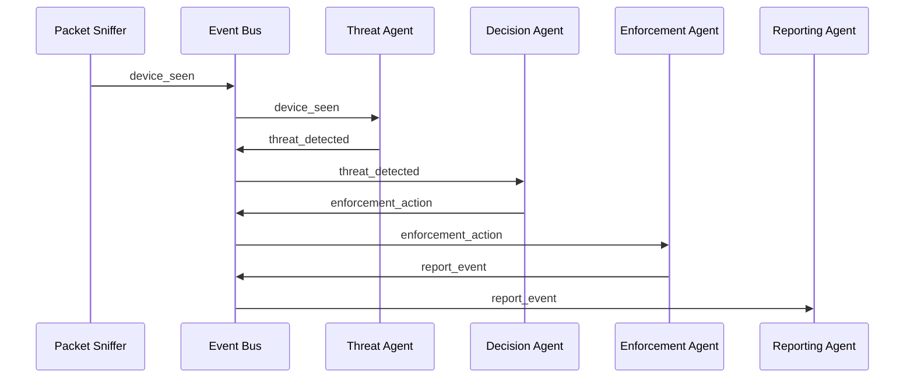

# Agentic AI And Response Flow

This file explains how the app uses an agent-style response pipeline.

## 1. Why It Is Called Agentic

The backend is split into separate stages that behave like specialized agents.

Each stage has one clear responsibility and passes the result to the next stage.

The current agents are:

- Threat Agent
- Decision Agent
- Enforcement Agent
- Reporting Agent

They coordinate through the async event bus.

## 2. Main Event Bus File

- `backend/app/core/event_bus.py`

The event bus is a lightweight pub/sub queue.

Topics include:

- `device_seen`
- `threat_detected`
- `enforcement_action`
- `report_event`

## 3. Full Agent Flow

## 4. Threat Agent

File:

- `backend/app/agents/threat_agent.py`

Responsibilities:

- evaluate rule engine output
- evaluate anomaly model output
- calculate risk
- enrich with GeoIP
- publish `threat_detected`

## 5. Decision Agent

File:

- `backend/app/agents/decision_agent.py`

Responsibilities:

- convert risk into action
- identify likely network origin
- build response mode and context
- choose honeypot port based on protocol and destination port
- publish `enforcement_action`

Important behavior:

- SSH-like ports such as `21`, `22`, `23`, `3389`, and `5900` are treated as candidates for redirect to Cowrie
- other TCP cases may be redirected to the HTTP honeypot or handled differently based on the action

## 6. Enforcement Agent

File:

- `backend/app/agents/enforcement_agent.py`

Responsibilities:

- apply `rate_limit`
- apply `honeypot` redirect
- apply `block`
- register redirect context so honeypot sessions can later be mapped back to the attacked victim

Important improvement already present:

Redirect is flow-aware, not just attacker-IP-aware.

That means it can track:

- attacker IP
- victim IP
- victim port

## 7. Reporting Agent

File:

- `backend/app/agents/reporting_agent.py`

Responsibilities:

- persist threat events to the DB
- broadcast live threat updates to the UI
- update device risk
- broadcast incident response summaries

## 8. Why This Design Is Useful

This structure makes the system easier to:

- understand
- extend
- test
- replace piece by piece

For example:

- you can improve the rule engine without rewriting the frontend
- you can improve decisions without rewriting packet capture
- you can improve enforcement without changing UI models

## 9. Future Agentic Improvements

Possible upgrades:

- policy tuning agent
- deception profile selection agent
- false-positive feedback agent
- adaptive quarantine agent
- asset criticality agent
