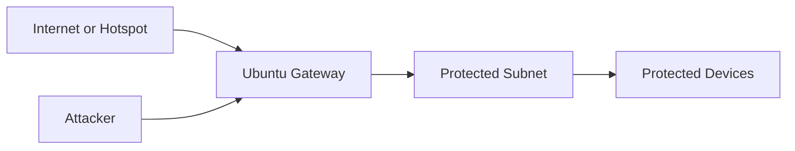

# Deployment And Improvement Roadmap

This file explains how to think about local development, Ubuntu deployment, and future improvements.

## 1. Local Development

Best for:

- API work
- UI work
- schema changes
- direct honeypot tests

Use:

- Windows or local machine
- backend local or Docker
- Flutter local

## 2. Ubuntu Gateway Deployment

Best for:

- real packet capture
- nftables enforcement
- protected subnet testing
- victim-aware redirect behavior

Use:

- Ubuntu Server
- Docker for app services
- host-level routing and firewall

## 3. Real Deployment Model

The strongest real architecture is:

This allows:

- packet visibility
- attacker identification
- victim identification
- transparent redirect to honeypot

## 4. How To Deploy On Ubuntu

1. prepare Ubuntu with 2 NICs
2. enable routing
3. create the protected subnet
4. copy the project folder
5. run Docker stack
6. run migrations
7. connect victims behind Ubuntu
8. test from Kali

## 5. Improvement Roadmap

### Detection

- improve packet feature extraction
- improve anomaly model training visibility
- add attack family labels
- add asset criticality awareness

### Agents

- add policy tuning agent
- add deception service selector
- add feedback-driven false positive reduction

### Firewall

- richer per-device rules
- more explicit flow diagnostics
- chain and handle health visibility
- better Linux host integration

### Honeypot

- add more deception services
- better command timeline playback
- stronger victim-to-session correlation

### Frontend

- add setup wizard
- add better threat timeline
- add device-centric attack history
- add enforcement diagnostics panel

## 6. Best Pitch Message

When explaining the system, the strongest message is:

> We place an Ubuntu-based security gateway in front of protected devices, inspect suspicious traffic, redirect hostile sessions to deception services, and show attacker, victim, and command-level telemetry in real time.
