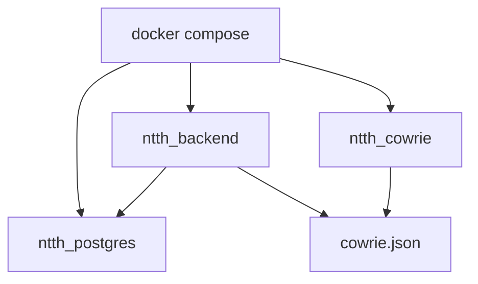

# Docker Setup

## Main File

Path: `backend/docker-compose.yml`

## What Docker Starts

### PostgreSQL

- container: `ntth_postgres`
- image: `postgres:15-alpine`
- port: `5432`

### Backend

- container: `ntth_backend`
- built from `backend/Dockerfile`
- ports:
  - `8000` FastAPI and frontend
  - `8888` HTTP honeypot
  - `80` mapped to `8888`

### Cowrie

- container: `ntth_cowrie`
- image: `cowrie/cowrie:latest`
- host port `30022`
- container port `2222`

## Runtime Relationships



## Important Mounted Paths

- `backend/geoip` -> `/app/geoip`
- `backend/logs` -> `/app/logs`
- `backend/cowrie/logs` -> `/cowrie_logs`

## Important Env Values

- `DATABASE_URL`
- `NETWORK_INTERFACE`
- `GATEWAY_IP`
- `COWRIE_LOG_PATH`
- `COWRIE_REDIRECT_PORT`
- `FIREWALL_ENABLED`

## Start Commands

```powershell
cd backend
docker compose up -d --build
```

## Verify Commands

```powershell
docker ps
docker compose logs backend
docker compose logs cowrie
docker compose logs postgres
```

## Important Current Limitation

Windows plus Docker works well for:

- API
- UI
- direct Cowrie tests

But it is weak for:

- true host-level transparent redirection
- preserving real attacker IP through Docker NAT
