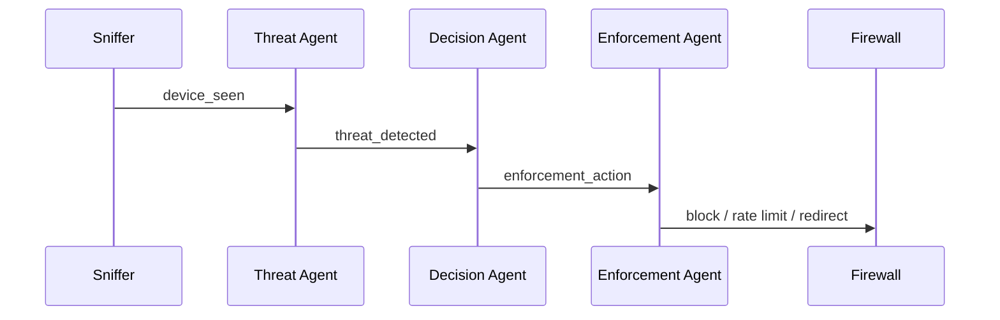
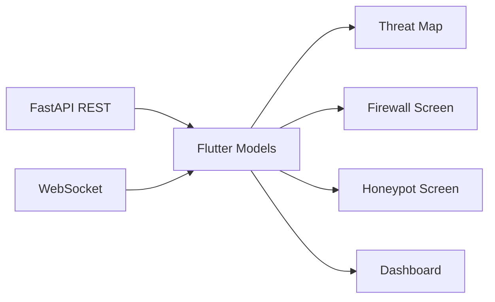

# Frontend And Backend Flow

## Backend Entry

Path: `backend/app/main.py`

On startup it:

1. initializes the DB
2. seeds the admin user
3. starts the event bus
4. starts the scheduler
5. starts the packet sniffer
6. starts the HTTP honeypot
7. starts the Cowrie watcher
8. mounts the Flutter web build

## Threat Pipeline Files

- `backend/app/monitor/packet_sniffer.py`
- `backend/app/agents/threat_agent.py`
- `backend/app/agents/decision_agent.py`
- `backend/app/agents/enforcement_agent.py`

## Threat Pipeline Flow

## What Each Agent Does

### Threat Agent

- runs rule-based checks
- runs anomaly scoring
- calculates risk
- enriches with GeoIP
- publishes `threat_detected`

### Decision Agent

- turns risk into action
- decides whether to allow, rate limit, redirect, or block
- adds incident context

### Enforcement Agent

- applies firewall or redirect logic
- registers redirect context for honeypot sessions

## Frontend Core Files

- `flutter_app/lib/core/api_client.dart`
- `flutter_app/lib/core/websocket_service.dart`

## Frontend Data Sources

### REST

Used for:

- threats
- devices
- firewall rules
- honeypot sessions

### WebSocket

Used for:

- live updates
- recent events
- session freshness

## UI Flow

## Important UX Goal

The UI should clearly show:

- who attacked
- which device was attacked
- what action was taken
- whether the source IP is real or masked
- which commands were typed in the honeypot
