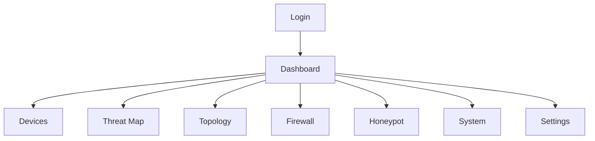

# Frontend Screen By Screen Walkthrough

This file explains the frontend screen structure and what each page is responsible for.

Main app file:

- `flutter_app/lib/main.dart`

## 1. Navigation Routes

Defined in `main.dart`:

- `/login`
- `/dashboard`
- `/devices`
- `/threats`
- `/topology`
- `/firewall`
- `/honeypot`
- `/system`
- `/settings`

## 2. Login Screen

File:

- `flutter_app/lib/screens/login_screen.dart`

Purpose:

- collect username and password
- call the login API
- store tokens via `AuthService`

## 3. Dashboard Screen

File:

- `flutter_app/lib/screens/dashboard_screen.dart`

Purpose:

- command center view
- summary of incidents, devices, firewall mode, and live feed

It loads:

- `/system/stats`
- `/network/topology`
- `/system/health`
- `/system/agents`
- `/firewall/status`

It reacts to WebSocket events such as:

- `threat`
- `incident_response`
- `honeypot_session`
- `topology_updated`
- `device_seen`
- `device_updated`

Main UX role:

- top-level situational awareness

## 4. Devices Screen

File:

- `flutter_app/lib/screens/devices_screen.dart`

Purpose:

- show the protected asset inventory
- show device risk
- allow trust toggle for admins
- allow scan trigger

It loads:

- `/devices`

It can call:

- `PUT /devices/{device_id}/trust`
- `POST /network/scan`

It reacts to WebSocket:

- `device_updated`
- `device_seen`
- `topology_updated`

## 5. Threat Map Screen

File:

- `flutter_app/lib/screens/threat_map_screen.dart`

Purpose:

- show stored threat history
- show geolocated threats when latitude and longitude exist
- show attacker IP, victim IP, action, and response context

It loads:

- `/threats`

It reacts to:

- `threat`

Important UI features:

- severity filtering
- search by attacker, victim, action, or threat type
- map + list view

## 6. Topology Screen

File:

- `flutter_app/lib/screens/network_topology_screen.dart`

Purpose:

- show the network graph of gateway, server, devices, attackers, and honeypot

Likely data source:

- `/network/topology`

Main UX role:

- show the structural relationship between network nodes

## 7. Firewall Screen

File:

- `flutter_app/lib/screens/firewall_screen.dart`

Purpose:

- show what containment is active
- show whether enforcement is real, simulated, or degraded
- show attacker-to-victim-to-honeypot redirect context

It loads:

- `/firewall/rules`
- `/firewall/status`

Admin actions:

- delete specific rule
- emergency flush

Important UX features:

- search by attacker IP, victim IP, rule type, or reason
- summary pills for blocks, redirects, and rate limits

## 8. Honeypot Screen

File:

- `flutter_app/lib/screens/honeypot_screen.dart`

Purpose:

- show deception sessions
- show credentials attempted
- show commands typed
- show attacked victim IP and observed source masking state

It loads:

- `/honeypot/sessions`
- `/honeypot/status`

Admin actions:

- start Cowrie
- stop Cowrie

It reacts to:

- `honeypot_session`

Important UX details:

- active sessions show `active now`
- shows `Attacked IP`
- shows `Observed IP` when the source seen by Cowrie is masked
- shows source note when Docker/NAT hides the original source

## 9. System Health Screen

File:

- `flutter_app/lib/screens/system_health_screen.dart`

Purpose:

- show backend runtime health
- show packet capture mode
- show firewall mode
- show scheduler and event bus health

Likely data source:

- `/system/health`

## 10. Settings Screen

File:

- `flutter_app/lib/screens/settings_screen.dart`

Purpose:

- configure base API and WebSocket target
- support switching environments

This is important when moving between:

- localhost
- Windows host
- Ubuntu VM
- gateway IP

## 11. Screen Relationships

## 12. Frontend Core Services

### Auth service

- stores auth state
- manages login/logout

### API client

- adds bearer token
- refreshes token automatically

### WebSocket service

- maintains live connection
- reconnects automatically
- stores recent events in memory
