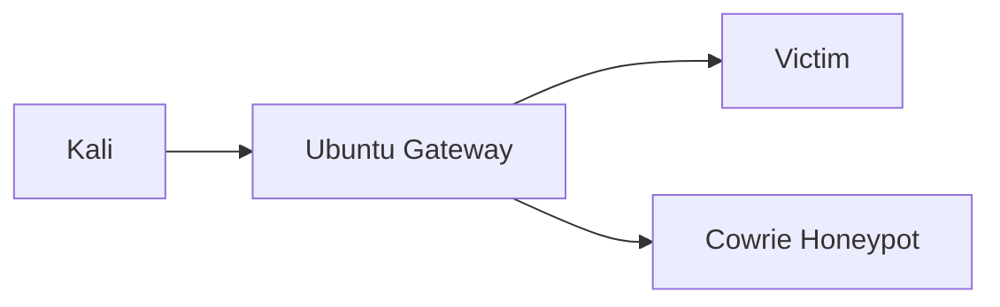

# Gateway Lab Flow

This is the main architecture for the real concept.

## Goal

- Kali attacks a victim
- Ubuntu sits in the middle
- Ubuntu detects the attack
- Ubuntu redirects suspicious traffic to the honeypot
- UI shows attacker IP, victim IP, and commands

## Machines

1. Ubuntu Gateway
2. Kali Attacker
3. Victim VM or device

## Example Addressing

### Upstream side

- Ubuntu: `10.10.10.1`
- Kali: `10.10.10.20`

### Protected side

- Ubuntu: `192.168.50.1`
- Victim: `192.168.50.10`

Victim gateway:

- `192.168.50.1`

## Why This Works

Kali and Victim are on different subnets, so traffic must pass through Ubuntu.

That gives Ubuntu control over:

- packet observation
- threat detection
- redirect rules
- victim-aware logging

## Lab Flow



## Build Steps

### 1. Prepare victim

On the victim:

```bash
sudo apt update
sudo apt install -y openssh-server
sudo systemctl enable ssh
sudo systemctl start ssh
```

### 2. Set victim network

- IP: `192.168.50.10/24`
- gateway: `192.168.50.1`

### 3. Set Kali network

- IP: `10.10.10.20/24`
- gateway: `10.10.10.1`

### 4. Verify routing

From Kali:

```bash
ping 10.10.10.1
ping 192.168.50.10
```

### 5. Verify real victim access first

From Kali:

```bash
ssh <victim-user>@192.168.50.10
```

This should reach the real victim before deception is turned on.

### 6. Start the app

On Ubuntu:

```bash
cd ~/projects/No\ Time\ To\ Hack/backend
docker compose up -d --build
```

### 7. Test attack flow

From Kali:

```bash
nmap -sS -Pn 192.168.50.10
ssh root@192.168.50.10
```

If redirect is active, Kali should land in Cowrie instead of the real victim.

## Expected UI Result

### Threat Map

- attacker IP
- victim IP
- port
- severity

### Firewall

- attacker to victim to honeypot flow

### Honeypot

- credentials tried
- commands
- victim context
- session state

## Important Real Constraint

If Ubuntu is not in the traffic path, this model does not work.

That is why the protected subnet behind Ubuntu is the correct architecture.
