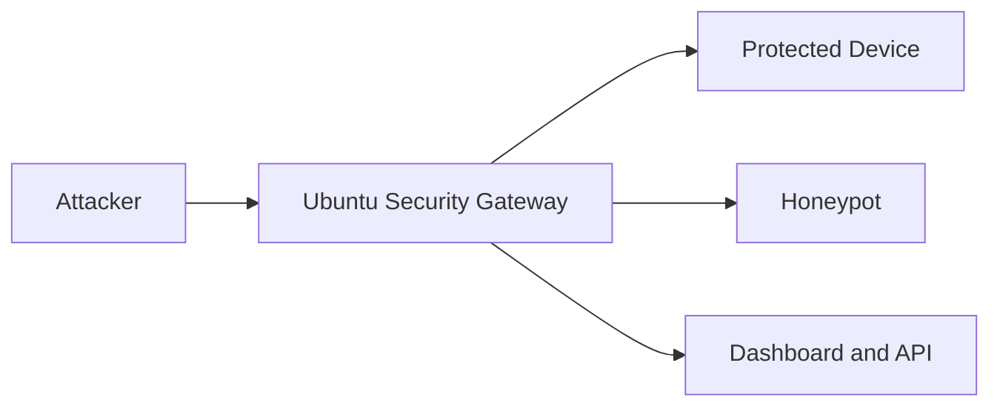

# How To Pitch The System

This file explains how to present the project clearly to reviewers, judges, or stakeholders.

## 1. Short Pitch

NO TIME TO HACK is an Ubuntu-based adaptive honeypot firewall that sits in front of protected devices, detects suspicious traffic, redirects attackers into deception services, and shows attacker, victim, and command-level activity in real time.

## 2. The Problem

Traditional small-network security setups often have weak visibility into:

- who is attacking
- which device was targeted
- what the attacker tried to do after access

Most simple firewalls only block or allow. They do not explain attacker behavior in depth.

## 3. Our Solution

We combine:

- packet inspection
- threat scoring
- response automation
- deception
- real-time visualization

That means the system does not just block an attacker. It can also:

- divert them
- observe them
- preserve victim context
- capture commands

## 4. Core Differentiator

The strongest differentiator is:

> the system can redirect a hostile flow aimed at a protected device into a honeypot while still showing which original device was targeted.

This matters because attackers often choose from a pool of devices, not one fixed IP.

## 5. Architecture Summary

## 6. How To Explain The Agentic Part

Say this simply:

- one part observes traffic
- one part scores the threat
- one part decides the response
- one part applies the response
- one part reports the result live

That is why the backend is called agentic.

## 7. Key Value Points

- real-time threat visibility
- attacker and victim context
- deception-based containment
- command capture from SSH honeypot sessions
- UI for device, threat, firewall, and honeypot visibility

## 8. Honest Technical Positioning

Say this clearly if asked:

- Windows plus Docker is good for development and demos
- Ubuntu gateway mode is the real architecture for transparent interception

That makes the pitch more credible, not weaker.

## 9. Demo Story

A clean demo flow:

1. show protected device in the UI
2. attack that device from Kali
3. show threat event appear
4. show firewall response
5. show honeypot session
6. show commands typed by the attacker

## 10. Best One-Line Close

We are building a security gateway that does not just stop attacks, but turns them into intelligence.
