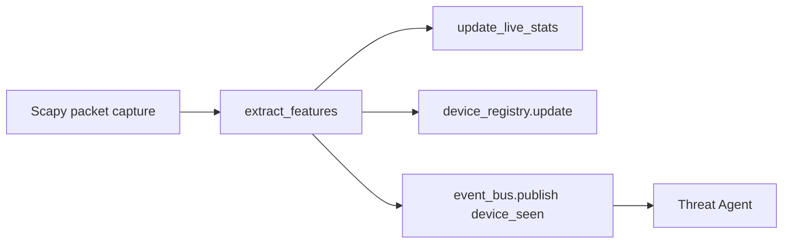

# Packet Sniffing And Attack Detection

This file explains how the app observes traffic, extracts features, and turns them into threat events.

## 1. Main Files

- `backend/app/monitor/packet_sniffer.py`
- `backend/app/monitor/feature_extractor.py`
- `backend/app/monitor/device_registry.py`
- `backend/app/ids/rule_engine.py`
- `backend/app/ids/anomaly_model.py`
- `backend/app/ids/risk_calculator.py`
- `backend/app/agents/threat_agent.py`

## 2. Packet Sniffing Purpose

The sniffer is the first live input point for the system.

Its job is to:

- capture packets
- normalize useful fields
- update live device state
- publish packet-derived events into the event bus

## 3. Sniffer Flow

## 4. How The Sniffer Starts

The sniffer is started by `backend/app/main.py` during application startup.

It tries to:

- import Scapy
- check whether capture is supported
- choose an interface
- run an `AsyncSniffer`

## 5. Interface Selection

The sniffer uses:

- the configured `NETWORK_INTERFACE`, or
- a detected best interface if needed

On Windows, the code tries to avoid virtual-only interfaces and prefers private active interfaces.

On Ubuntu gateway mode, you should explicitly set the protected or relevant interface.

## 6. Packet Feature Extraction

Even though not every packet field is stored directly, the project extracts the fields needed for:

- source IP
- destination IP
- destination port
- protocol
- timing and behavior patterns

These become the `features` object passed through the rest of the pipeline.

## 7. Rule-Based Detection

The rule engine looks for suspicious behavior such as:

- port scanning
- brute-force style repeated access
- heavy connection bursts

This gives a `rule_score` and `threat_type`.

## 8. ML-Based Detection

The anomaly model adds an ML score on top of the rule score.

This is useful for:

- spotting abnormal patterns not fully covered by fixed rules
- improving sensitivity over time

## 9. Risk Calculation

The risk calculator combines:

- rule score
- ML score

Then it chooses a base action:

- allow
- log
- rate_limit
- honeypot
- block

## 10. Threat Agent Role

The Threat Agent is the first real "security brain" after raw packet capture.

It:

- receives `device_seen`
- updates registry state
- runs the IDS pipeline
- enriches with GeoIP when possible
- publishes `threat_detected`

## 11. Catching Attackers In Practice

The system "catches attackers" in layers:

1. it sees source and destination behavior
2. it recognizes suspicious patterns
3. it scores the threat
4. it records the event
5. it can redirect or block the source

## 12. Important Deployment Note

Packet capture alone does not guarantee transparent defense.

To both detect and actively divert attackers, the enforcement host must sit in the network path.
