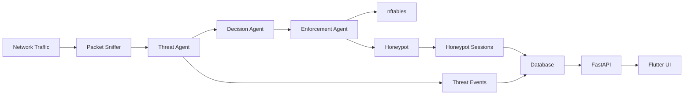

# System Overview

## What The System Does

NO TIME TO HACK is an adaptive honeypot firewall system.

It is built from:

- FastAPI backend
- Flutter frontend
- PostgreSQL or SQLite
- packet sniffer
- threat scoring pipeline
- firewall response logic
- Cowrie SSH honeypot
- HTTP honeypot

## Core Goal

When an attacker targets a device, the system should:

1. see the traffic
2. score the threat
3. decide the response
4. redirect or block if needed
5. log the session
6. show the attacker, victim, and commands in the UI

## Main Components

### Backend

Path: `backend/app/`

Responsibilities:

- starts the app
- runs API routes
- starts packet sniffing
- starts event bus and scheduler
- ingests honeypot logs
- serves the frontend build

### Frontend

Path: `flutter_app/lib/`

Responsibilities:

- login
- fetch REST data
- subscribe to live WebSocket events
- render dashboard, threat map, firewall, and honeypot sessions

### Database

Path: `backend/app/database/`

Stores:

- users
- devices
- threat events
- firewall rules
- honeypot sessions

### Honeypots

Paths:

- `backend/app/honeypot/http_honeypot.py`
- `backend/app/honeypot/cowrie_watcher.py`
- `backend/cowrie/cowrie.cfg`

## High-Level Flow

## Important Deployment Truth

For full transparent protection of a pool of devices, the Ubuntu machine must sit in the traffic path.

That is why the real deployment model is:

- Ubuntu as gateway
- protected subnet behind Ubuntu
- attacker traffic passes through Ubuntu before reaching protected devices
