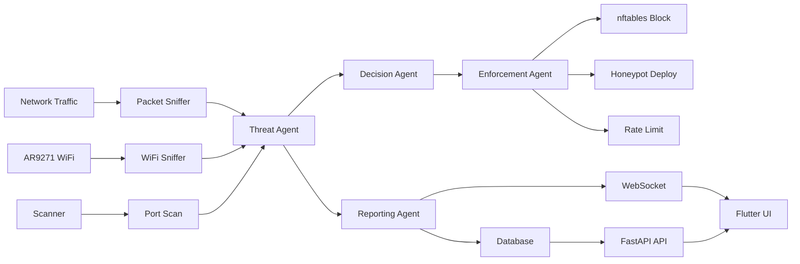

# System Overview

> Last updated: 2026-05-02

## What The System Does

**NO TIME TO HACK (NTTH)** is an autonomous network defense framework that combines:

- **Intrusion Detection** — Real-time packet capture + ML-based anomaly scoring
- **Active Defense** — Multi-protocol honeypots auto-deployed on attacked ports
- **Wireless Monitoring** — AR9271 USB adapter in monitor mode for 802.11 frame analysis
- **Automated Response** — AI agent pipeline that detects, decides, and enforces in <100ms

## Architecture

```
                  ┌──────────────────────────────────────────┐
                  │          NTTH DEFENSE SYSTEM             │
                  ├──────────────────────────────────────────┤
                  │                                          │
   ┌──────────┐  │  ┌─────────┐  ┌──────────┐  ┌────────┐  │
   │ Main NIC │──┼─►│ Packet  │  │ Network  │  │ AR9271 │  │
   │(promisc) │  │  │ Sniffer │  │ Scanner  │  │WiFi Mon│  │
   └──────────┘  │  └────┬────┘  └────┬─────┘  └───┬────┘  │
                 │       │            │             │       │
                 │       ▼            ▼             ▼       │
                 │  ┌──────────────────────────────────┐    │
                 │  │          EVENT BUS (pub/sub)      │    │
                 │  └──────────────┬───────────────────┘    │
                 │                 │                         │
                 │    ┌────────────┼────────────┐           │
                 │    ▼            ▼            ▼           │
                 │  Threat    Decision    Enforcement       │
                 │  Agent     Agent       Agent             │
                 │  (IDS+ML)  (Risk→Act)  (Block/Redirect) │
                 │                             │            │
                 │    ┌────────────────────────┐            │
                 │    │  HONEYPOT MESH         │            │
                 │    │  FTP:21 Telnet:23      │            │
                 │    │  MySQL:3306 RDP:3389   │            │
                 │    │  VNC:5900 SMB:445      │            │
                 │    │  Redis:6379 Mongo:27017│            │
                 │    │  HTTP:8888 + dynamic   │            │
                 │    └────────────────────────┘            │
                 │                                          │
                 │  ┌──────────────────────────────────┐    │
                 │  │   Flutter Dashboard (10 screens)  │    │
                 │  │   WebSocket real-time updates     │    │
                 │  └──────────────────────────────────┘    │
                 │                                          │
                 │  Port: 8001 │ DB: SQLite │ Auth: JWT     │
                 └──────────────────────────────────────────┘
```

## Core Components

### Backend (`backend/app/`)

| Module | Purpose |
|--------|---------|
| `main.py` | FastAPI app + startup (sniffer, scanner, honeypots, WiFi) |
| `monitor/packet_sniffer.py` | Scapy AsyncSniffer with promiscuous mode |
| `monitor/network_scanner.py` | Ping sweep + 28-port TCP connect scan |
| `monitor/feature_extractor.py` | Extract 8 IDS features per packet |
| `agents/` | 6-agent AI pipeline (Threat→Decision→Enforcement→Reporting→Feedback) |
| `ids/rule_engine.py` | Port scan, SYN flood, brute force detection |
| `ids/anomaly_model.py` | Isolation Forest ML (200 trees) |
| `firewall/nft_manager.py` | nftables block/rate-limit/redirect |
| `honeypot/multi_honeypot.py` | 8+ protocol honeypots on common attack ports |
| `wireless/auto_monitor.py` | AR9271 auto-detect + safe monitor mode |
| `wireless/wifi_sniffer.py` | 802.11 frame capture (probes, beacons, deauth) |

### Frontend (`flutter_app/lib/`)

10 screens: Dashboard, Devices, Threat Map, Network Topology, Firewall, Honeypot, Wireless, Packets, System, Settings

Real-time WebSocket updates with auto-reconnect.

### Database (`ntth.db` — SQLite)

| Table | Purpose |
|-------|---------|
| `users` | Admin authentication |
| `devices` | Discovered hosts + MAC + vendor + **open ports** |
| `threat_events` | IDS detections with risk scores |
| `firewall_rules` | Active/expired rules |
| `honeypot_sessions` | Captured attacker interactions |
| `captured_packets` | Raw packet forensic log |

## Defense Flow


```mermaid
flowchart LR
    A[Network Traffic] --> B[Packet Sniffer]
    W[AR9271 WiFi] --> X[WiFi Sniffer]
    S[Scanner] --> Y[Port Scan]
    B --> C[Threat Agent]
    X --> C
    Y --> C
    C --> D[Decision Agent]
    D --> E[Enforcement Agent]
    E --> F[nftables Block]
    E --> G[Honeypot Deploy]
    E --> R[Rate Limit]
    C --> H[Reporting Agent]
    H --> J[Database]
    H --> K[WebSocket]
    J --> L[FastAPI API]
    K --> M[Flutter UI]
    L --> M
```

## Deployment

- **Port**: 8001
- **WiFi Band**: 2.4 GHz (AR9271 requirement)
- **Subnet**: Auto-detected (10.223.251.0/24)
- **Startup**: `bash start.sh` or `sudo venv/bin/uvicorn app.main:app --host 0.0.0.0 --port 8001`
- **Access**: http://localhost:8001
- **Login**: admin / NtthAdmin2026

## Key Design Decisions

1. **NetworkManager-safe**: Uses `nmcli device disconnect` instead of `airmon-ng check kill` — main WiFi stays connected
2. **USB adapter only**: Monitor mode targets `wlx*` interfaces — never touches the system NIC
3. **Promiscuous mode**: Main sniffer runs with `promisc=True` for wider traffic capture
4. **No fake data**: Simulation routes permanently disabled; all data is from live network
5. **Persistent DB**: SQLite on disk survives restarts; safe ALTER TABLE migrations on startup
